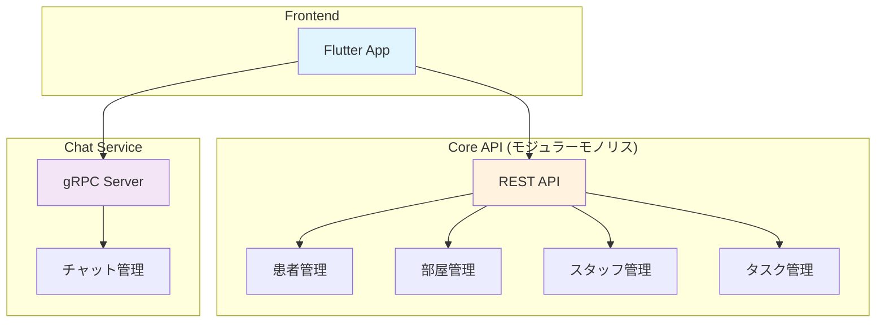

# healthcare_support

医療従事者向けの患者管理Flutterアプリケーション。

## アーキテクチャ

## バックエンドアーキテクチャ

バックエンドは2つの主要なサービスで構成されています：

### Core API (モジュラーモノリス)
- RESTful API
- 以下のリソースを管理：
  - 患者情報
  - 部屋情報
  - スタッフ情報
  - タスク管理

### Chat Service
- gRPCベースの双方向ストリーミング通信
- 医療スタッフ間のチャット機能を提供
- 主な機能：
  - 双方向ストリーミングによるリアルタイムチャット
  - ルーム参加/退出の管理
  - アクティブユーザーの追跡

## API仕様

APIの詳細仕様は以下のファイルで定義されています：

- [Core API仕様書](api/schemas/core-api.yaml) - REST APIの詳細仕様
- [Chat Service Proto](api/protos/chat.proto) - gRPCサービスの定義

## ページ構成

アプリケーションは以下の2つの主要な画面で構成されています：

### 患者選択画面 (Patient Selection Screen)
`lib/screens/patient_selection_screen.dart`

患者一覧を表示し、詳細確認したい患者を選択するための画面です。

機能：
- 患者一覧の表示
- 各患者の基本情報（名前、部屋番号）の表示
- 患者詳細画面への遷移機能

### 患者詳細画面 (Patient Detail Screen)
`lib/screens/patient_detail_screen.dart`

選択された患者の詳細情報を表示する画面です。
3つのタブで構成されています：

1. プロフィールタブ
   - 患者ID
   - 年齢
   - 血液型
   - 部屋番号
   - 入院日
   - 担当医
   - 現在の状態
   など、患者の基本情報を表示

2. チャットタブ
   - 医療スタッフ間のコミュニケーション機能
   - gRPCストリーミングによるリアルタイムメッセージング
   - チャット履歴の表示
   - ルーム参加者のステータス表示

3. TODOタブ
   - 患者に関するタスク管理
   - タスクの追加機能
   - タスクの完了状態の管理
   - タスクの期限表示

## Getting Started

This project is a starting point for a Flutter application.

A few resources to get you started if this is your first Flutter project:

- [Lab: Write your first Flutter app](https://docs.flutter.dev/get-started/codelab)
- [Cookbook: Useful Flutter samples](https://docs.flutter.dev/cookbook)

For help getting started with Flutter development, view the
[online documentation](https://docs.flutter.dev/), which offers tutorials,
samples, guidance on mobile development, and a full API reference.
